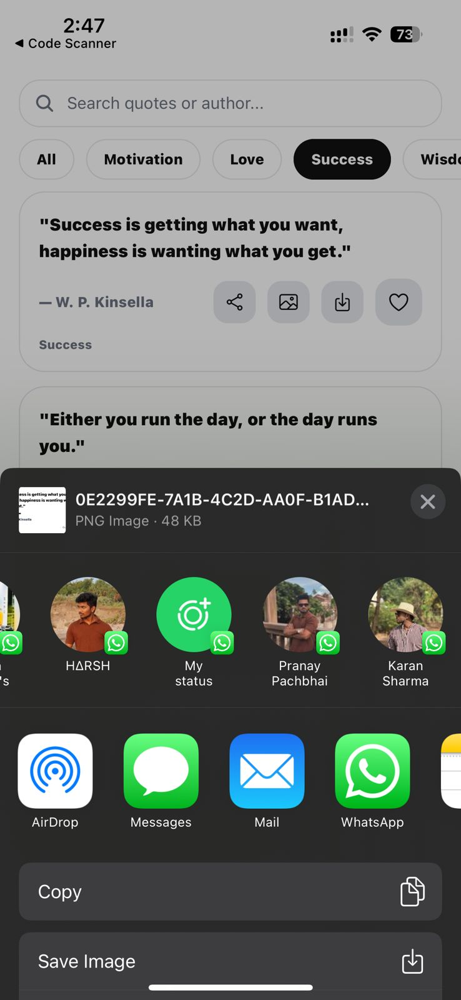
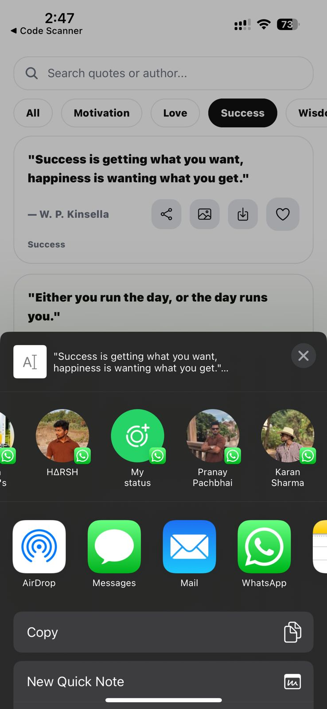

# QuoteVault 📖✨

A modern quote discovery app built using **Expo (React Native)** + **Supabase**, featuring daily inspiration, favorites, collections, and export/share options.

---

## 🚀 Features

### ✅ Authentication & User Profiles

- Email/Password signup & login using **Supabase Auth**
- Secure user access via **Row Level Security (RLS)**

### ✅ Quote Browsing

- Browse curated quotes with pagination (infinite scroll)
- Filter quotes by category
- Search quotes by text / author
- Quote of the Day section

### ✅ Favorites (Cloud Synced ❤️)

- Add/remove quotes to favorites
- Favorites stored in Supabase, synced across sessions

### ✅ Collections (Cloud Synced 📂)

- Create custom collections
- Add quotes to collections
- View and remove quotes from collections
- Collections stored in Supabase, synced across sessions

### ✅ Share & Export Module 📤

- Share quote text directly (native share sheet)
- Export quote card as image (PNG)
- Share quote image
- Download quote image (note Expo Go limitation)

### ✅ Personalization Settings 🎨

- Theme mode: Light / Dark
- Accent color: Black / Blue / Purple
- Font size scaling
- Daily quote notification time

### ✅ Daily Quote Notification 🔔

- User selects preferred time
- App triggers daily quote reminder notification

---

## 🧱 Tech Stack

- **Expo SDK 54**
- **React Native**
- **TypeScript**
- **Expo Router**
- **Supabase** (PostgreSQL + Auth + RLS)
- Libraries:
  - `expo-notifications`
  - `expo-sharing`
  - `expo-file-system`
  - `expo-media-library`
  - `react-native-view-shot`
  - `@react-native-async-storage/async-storage`

---

## 📂 Database (Supabase Schema)

Tables used:

- `quotes`  
  Stores all quotes

- `user_favorites`  
  Stores user’s favorite quote IDs  
  RLS: user can access only own favorites

- `collections`  
  Stores user-created collections  
  RLS: user can access only own collections

- `collection_quotes`  
  Join table mapping quotes ↔ collections  
  Includes `user_id` for proper ownership & RLS

- `user_settings`  
  Stores theme/accent/font/notification preferences

---

## 🔐 Security

✅ All user-related tables protected using **Supabase RLS Policies**  
Only logged-in user can read/write their own data.

---

## ▶️ Installation & Run

### 1) Clone the repo

```bash
git clone <your-repo-url>
cd QuoteVault2

## Install dependencies
npm install

## start the app
npx expo start

Scan QR with Expo Go, OR use a development build for full media support.

⚠️ Important Notes (Expo Go Limitations)
Expo Go has limitations:
✅ Sharing quote text & images works
⚠️ Saving image to gallery may not fully work (Android permissions)
✅ Will work fully in Development Build

## 📸 Screenshots

### Login Screen


### signup Screen


### Home Screen


### Favorites


### Collections


### Settings


### SharingTextImage


### SharingText



## 🎥 Loom Demo Video
<https://www.loom.com/share/28e03959c1ed46d6a13f6051140c5df3>


✅ Submission Checklist

1. Authentication working

2. Quote browsing + Quote of the Day

3. Favorites module

4. Collections module

5. Share/export module

6. Theme/Accent/Font settings

7. Notifications

8. README.md complete

9. Loom video link added

10. Screenshots added
```
